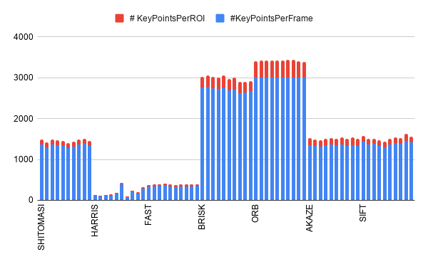

## Introduction
In this report, an analysis will be made to obtain the best image keypoints, descriptor generator and matcher. 
The keypoints generator used in this project are the following:
* HARRIS
* FAST 
* BRISK 
* ORB
* AKAZE
* SIFT
Regarding the descriptors, the analysis will be about the following ones:
* BRIEF
* ORB
* FREAK
* AKAZE 
* SIFT
Finally, the matchers used in this project are:
* FLANNBASED
* BRUTE FORCE pair matching

The performance analysis will be based on:
* time taken to compute keypoints and descriptors
* Number of points generated
* Number of matched KeyPoints ( i.e. true positive, false positive matches)

## Distribution of keypoints 

The distribution of keypoints generation above displayed shows that the algorithms with top number of points, either inside the region of interest (the car) either per the all frame, are BRISK and ORB. In addition, we can tell that the number of points generated per frame is quite stable per algorithm.  

[image_0]: https://github.com/brunoeducsantos/2DFeatureTracking/blob/master/images/BRISK.png
![alt text][image_0] 
Regarding the neighborhood size, **BRISK** has a quite dense number of points per pixel region and it is uniformely distributed in the vehicle region. 

[image_1]: https://github.com/brunoeducsantos/2DFeatureTracking/blob/master/images/AKAZE.png
![alt text][image_1] 

**AKAZE** keypoints neighborhood has lower density and the points are sparsed distributed around the ROI.

[image_2]: https://github.com/brunoeducsantos/2DFeatureTracking/blob/master/images/FAST.png
![alt text][image_2]

The **FAST** neighborhood density is quite low among all studied algorithms, with a high sparse distribution.

[image_3]: https://github.com/brunoeducsantos/2DFeatureTracking/blob/master/images/ORB.png
![alt text][image_3]

**ORB** feature generator has a high density of points per pixel patch and the number of points is even distributed. It is one of the highest overlap of keypoint patch among the studied algorithms.

[image_4]: https://github.com/brunoeducsantos/2DFeatureTracking/blob/master/images/SHITOMASI.png
![alt text][image_4]
 
Similarly to AKAZE keypoint distribution, **SHITOMASI** has a non-uniform density within the ROI .

[image_5]: https://github.com/brunoeducsantos/2DFeatureTracking/blob/master/images/SIFT.png
![alt text][image_5]

**SIFT** has lower density of points the ROI, but it has a uniform distribution of keypoints describing the car image patch.

## Reference
* [Performance data of descriptors and keypoints generators](https://docs.google.com/spreadsheets/d/1XjCx8vCeGhiXPxjZbKCU_fEnNz826EIpMes8a6IjI4E/edit?usp=sharing)

